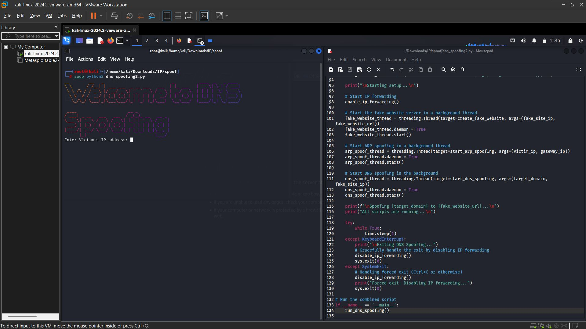
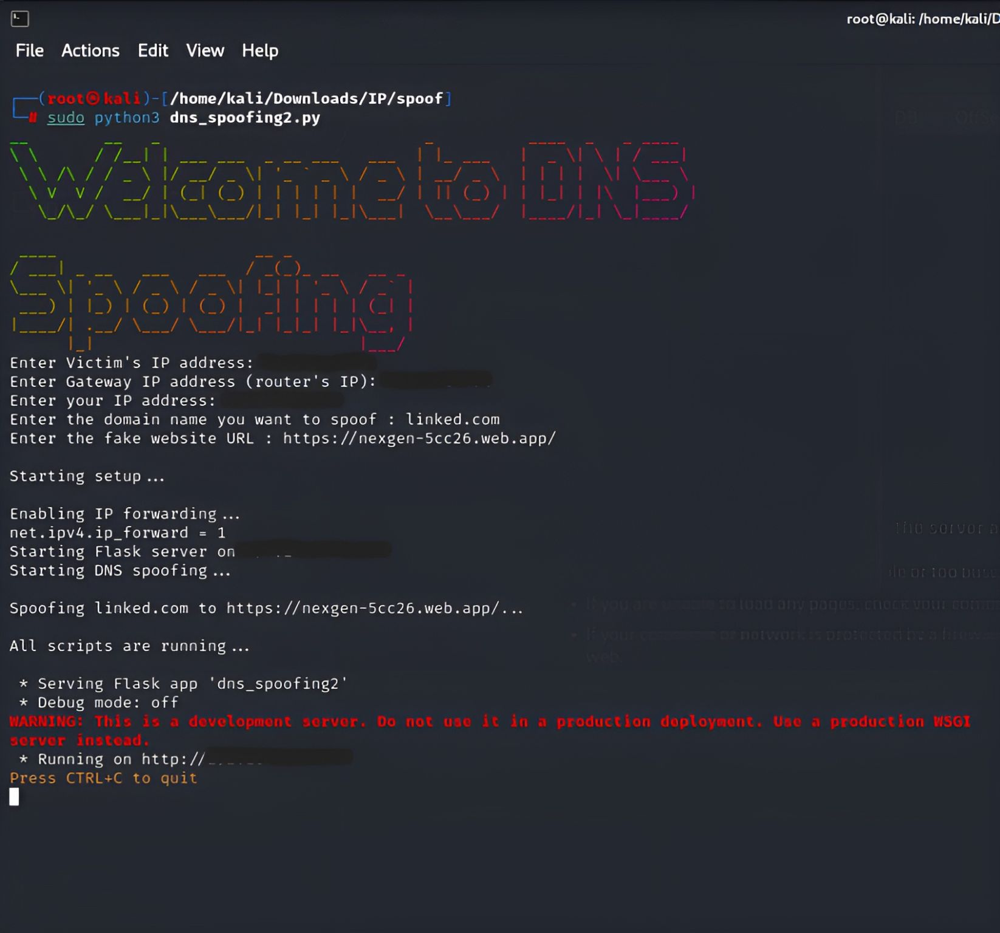
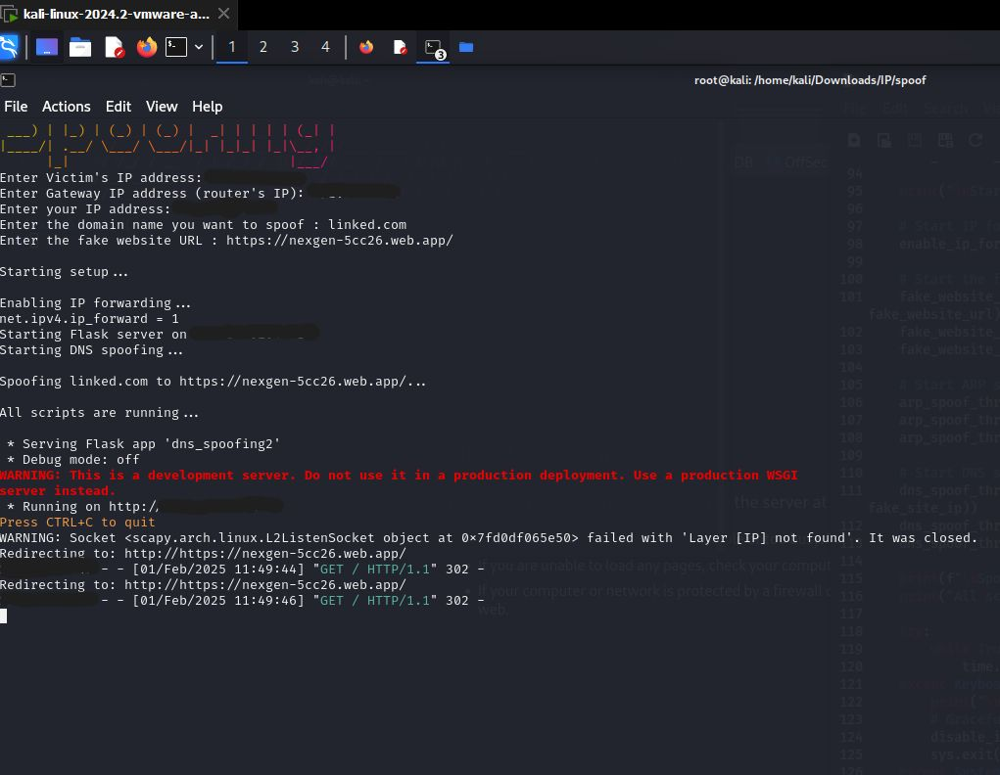

<h1 align ="center">🛠️💻 DNS Spoofing Tool 🌐🎯</h1>

 📌 Description

This tool performs **DNS Spoofing** on a local network. It intercepts DNS requests from a victim's device and redirects them to a fake website of your choosing. The spoofed domain and IP traffic are routed through a Flask-based fake web server.

> ⚠️ **Educational Use Only**: This tool is intended for ethical hacking and penetration testing within environments where you have **explicit permission**.

---

## ✨ Features

- 🔀 ARP spoofing to reroute victim traffic through your machine
- 🎯 DNS spoofing to redirect domain lookups
- 🌐 Flask web server to host a fake website
- 🧲 Captures both domain-based and direct IP traffic

---

## 🧰 Requirements

- **Python 3.x**
- **Flask** (`pip install flask`)
- **Scapy** (`pip install scapy`)
- **Figlet** (for banner display)

---

## 💾 Installation

### 1. Install Python and Pip

Download Python from the [official website](https://www.python.org/downloads/). Ensure pip is working:

```bash
pip --version
````

### 2. Install Required Libraries

```bash
pip install flask scapy
```

### 3. Install Figlet (Optional)

```bash
sudo apt-get install figlet
```

### 4. Clone the Repository

```bash
git clone https://github.com/Ravi2718/DNS-Spoofing.git
cd DNS-Spoofing
```


## 🚀 Usage

Run the script:

```bash
sudo python3 DNS_Spoofing.py
```

### When prompted, provide:

* 🧑 Victim’s IP address
* 🌐 Gateway IP (your router)
* 💻 Your local IP (Kali machine)
* 🕵️‍♂️ Domain to spoof
* 🎭 Fake website URL

Once running, all traffic to the spoofed domain or your machine's IP will redirect to your fake website.

### To stop the attack:

Press `CTRL+C`

---

## 🧯 Troubleshooting

* **Domain not redirecting**: Ensure DNS spoofing is active and victim DNS cache is flushed (`ipconfig /flushdns` on Windows).
* **IP redirects but domain doesn't**: Double-check domain matching in the DNS response.
* **HTTPS warnings**: Spoofing HTTPS domains will trigger browser certificate errors unless a valid certificate is spoofed (not recommended without advanced SSL interception).

---

## ⚖️ License

This project is licensed under the [MIT License](LICENSE).

---

## ⚠️ Disclaimer

* This tool is for **educational and ethical use only**.
* The author is **not responsible for any misuse**.
* Do **not** use on networks without full authorization.

---

## 👤 Author

> Ravi


---

<h1 align="center">🔗 Screenshots</h1>


<h2 align="center">DNS Spoofing - Screenshot 1</h2>
<p align="center">
  
</p>

<h2 align="center">DNS Spoofing - Screenshot 2</h2>
<p align="center">
  
</p>

<h2 align="center">DNS Spoofing - Screenshot 3</h2>
<p align="center">
  
</p>

<h2 align="center">DNS Spoofing - Screenshot 4</h2>
<p align="center">
  
</p>

<h2 align="center">DNS Spoofing - Screenshot 5</h2>
<p align="center">
  
</p>


